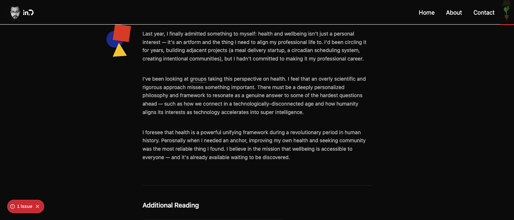

### Task 191 (snapshot): Bauhaus shapes layer — saved position

This snapshot preserves the Bauhaus-shape composition that briefly lived on
`/garden/article/health-longevity` so it can be restored later if desired.
The same commit that introduced this file was reverted in the next commit;
this file (plus the screenshot) stays on `main` as the reference.

## Visual reference


The composition (red square + blue circle + yellow triangle) sits in the
left margin, vertically aligned with the "Last year, I finally admitted
something to myself…" paragraph, with no overlap into the text column.

## Component (the snapshot file at the moment of capture)

`src/components/garden/health-shapes-layer.tsx`:

```tsx
const RED = "#D63B26";
const BLUE = "#1E2A8E";
const YELLOW = "#F2C530";

function Triangle({ size, color, rotate = 0 }: { size: number; color: string; rotate?: number }) {
  return (
    <svg width={size} height={size} viewBox="0 0 100 100" style={{ transform: `rotate(${rotate}deg)`, display: "block" }}>
      <polygon points="50,6 96,94 4,94" fill={color} />
    </svg>
  );
}

export function HealthShapesLayer() {
  return (
    <div aria-hidden className="hidden md:block absolute inset-0 pointer-events-none z-[5] overflow-hidden">
      <div className="absolute" style={{ left: "calc(50% - 410px)", top: "1090px" }}>
        <div className="absolute rounded-full" style={{ left: 0, top: "16px", width: "46px", height: "46px", background: BLUE }} />
        <div className="absolute" style={{ left: "20px", top: 0, width: "44px", height: "44px", background: RED, transform: "rotate(8deg)" }} />
        <div className="absolute" style={{ left: "14px", top: "46px", transform: "rotate(-4deg)" }}>
          <Triangle size={42} color={YELLOW} />
        </div>
      </div>
    </div>
  );
}
```

## Restoration steps

1. Recreate `src/components/garden/health-shapes-layer.tsx` with the code
   above.
2. In `src/app/garden/article/health-longevity/page.tsx`, import the
   component and render `<HealthShapesLayer />` as the first child of
   `<HealthGoldHoverShell>`, sibling of `<ArticleLayout>`.
3. Ensure `<ArticleLayout>` has `className="!bg-transparent"` so its bg
   doesn't cover the shape layer.
4. Ensure `HealthGoldHoverShell` has `relative bg-[#0b0b0b] min-h-screen`
   on its outer div to provide a positioning context + page bg.

## Position rationale

- Horizontal: `left: calc(50% - 410px)` puts the wrapper ~298px from
  viewport center on a 1400px viewport, ~24px outside the article column's
  left edge (`max-w-2xl` = 672px wide, centered).
- Vertical: `top: 1090px` (fixed pixels, not vh) aligns with the "Last
  year, I finally admitted…" paragraph at doc-Y ~1102px. Pixel value is
  used instead of vh because vh shifts the position with viewport height
  while the text-flow paragraph position is governed by column width only.
- Sizes: 46px circle, 44px square, 42px triangle — small enough to sit in
  the margin without overpowering the article body.

[Task-191]
